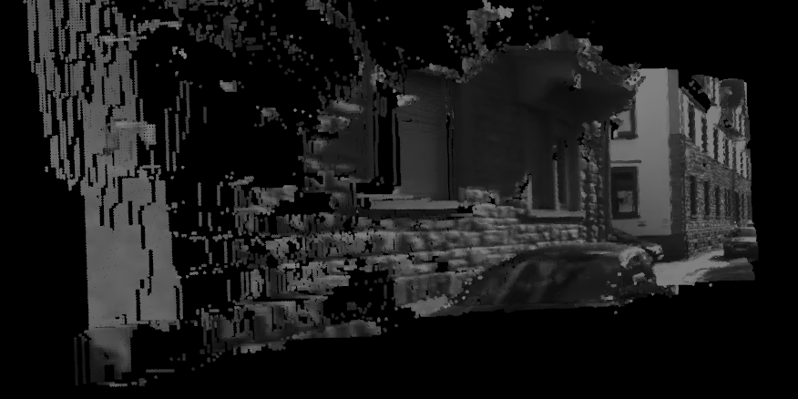
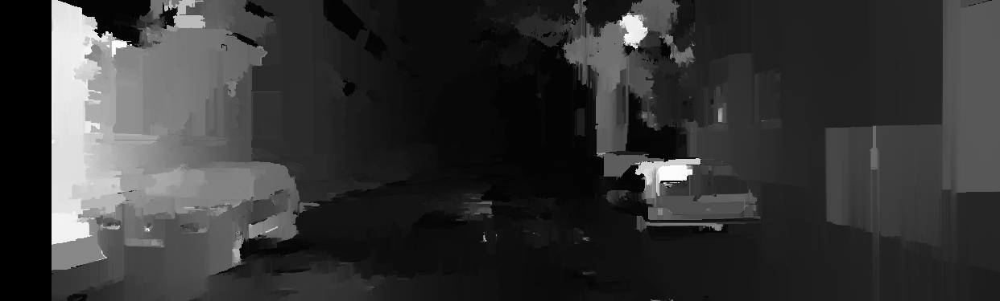

fake-stereo
---
playing around with cameras

[video](https://www.youtube.com/watch?v=Jq6Y4xFgfBE&list=PLz9N52s5FSIUFNoLjyNy_9EW42Ngy6ipn) of it in action

use two image frames from the same camera, taken at two different points in time as a stereo image pair, then make a 3d reconstruction

#### Note: does not work well

todo
---
 - make it not garbage
 - move out of a notebook into a script
    - supply arguments for input images and viewer
